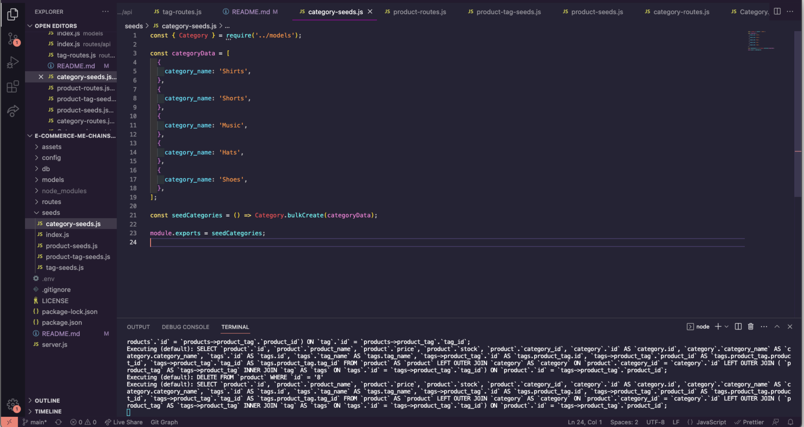

# e-commerce-me-chainsaw

## Description

The Purpose of the E-Commerce Me Chainsaw application is to give vendors an easy way to input inventory of an online shop by category and tag to keep an ordedrly storefront online that still looks lovely to the customers eye.

The hardest hurdle for me to get over was routes through the api, especially where to put them and what to call to inside them until I relaized most similar routes like a get and a get are very similar if they are using the same path like a get that uses "/" and another that uses "/" as the path will essentially do the same thing using different models. Which led me down the route of wow how much can I do with gets, puts and posts etc.? Then I wrote most of the backend for our sencond project just due to the motivation and confidence this excercise gave me.

## Installation

- To install The E Commerce Me Chainsaw application simply pull the SSH Link from the bright green code button in GitHub.
- Open up your terminal on your local machine and naviage to a directory you would like to store the code for this in type git clone then paste the SSH Link and hit enter.
- Once done you will have the full repo then it is just a matter of changing directories to The E Commerce Me Chainsaw application and using your preffered method for opening it in a code editor.

## Usage

To use the application currently the user can go to postman, or insomnia as pictured in the video walkthrough below and add and take away data to their hearts content till the graphic user inter is up and running for it

## License

MIT License

## Features

- Allows for the creation of, updates to and deletion  of any category inputed by the owner of the e-store as well as allows look up of all categories or lookup by id.

- Uses product tags to give id's and more oder to the product list

- Allows for creation of products to a certain category, population of price, amount in stock and id's to each category so they can be associated by name in the Graphic user interface accurately later on